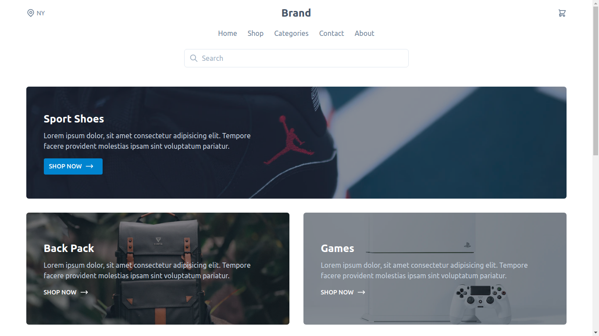
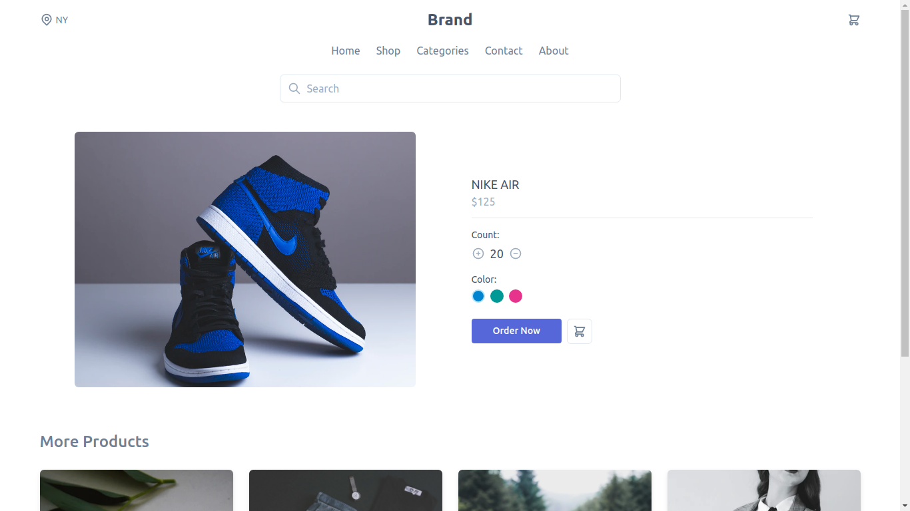
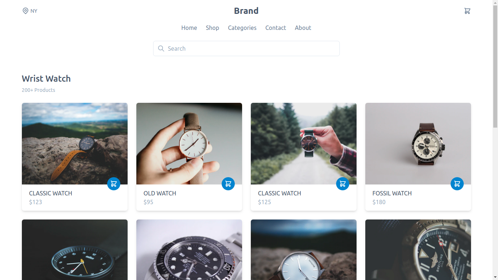
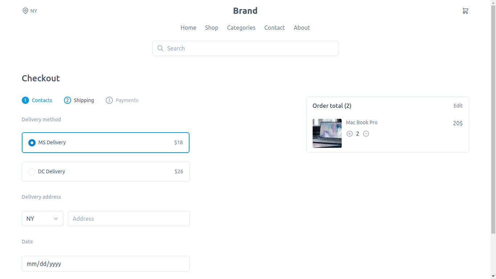
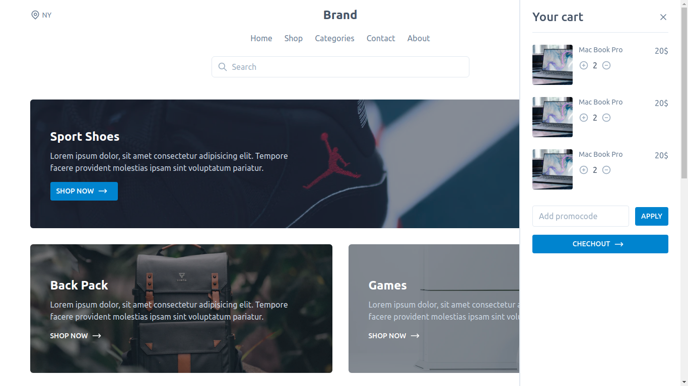

## E-commerce Template
<a href="https://github.com/tailwindcomponents/e-commerce/blob/master/LICENSE.md">
    
</a>
<a href="https://github.com/tailwindcomponents/e-commerce/stargazers">
    
</a>
<a href="https://twitter.com/TwComponents">
    
</a>

🕹 Start template for e-commerce projects build with Tailwindcss, Alpinejs and Laravel blade.

Live [Demo](https://ecommerce-tailwindcomponents.netlify.app)

## Resources
- [Jigsaw](https://jigsaw.tighten.co)
- [Tailwindcss](https://tailwindcss.com)
- [AlpineJS](https://github.com/alpinejs/alpine)
- [Heroicons](https://heroicons.dev)

## Screenshots











### Project setup

```
composer install && npm install
```

### Compiles and hot-reloads for development

```
npm run watch
vendor/bin/jigsaw serve
```

### Compiles and minifies for production

```
npm run production
vendor/bin/jigsaw serve
```
